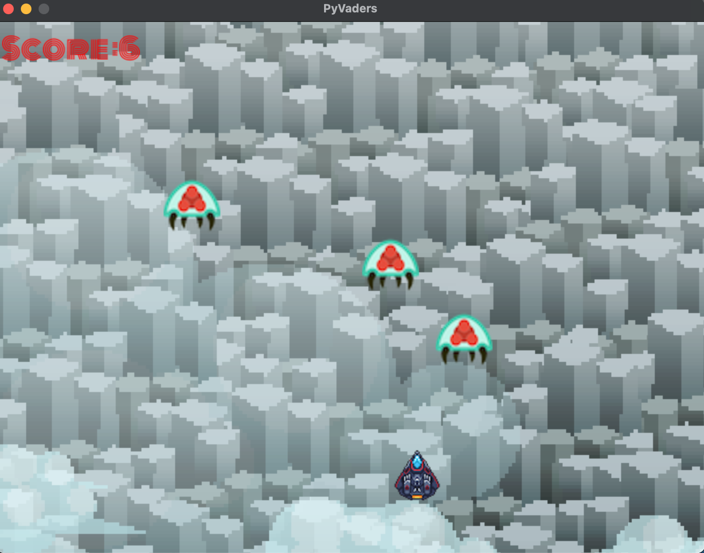

# PyVaders 👾 🚀
 

Space Invaders is a classic arcade game from the 1980s. PyInvaders is an implementation of this in python

[Source wiki](https://en.wikipedia.org/wiki/Space_Invaders)

> Within the shooter genre, Space Invaders was the first fixed shooter and set the template for the shoot 'em up genre. The goal is to defeat wave after wave of descending aliens with a horizontally moving laser to earn as many points as possible.

If the Alien touches the ship it's **GameOver**

[Original Source Code](https://www.udemy.com/course/python-game-development-using-pygame-and-python-3/)

## Controllers 🎮

- Moment : left and right keys on your keyboard
- Laser : spaceBar

### How to contrubite to the project

Goal: to get more people to contrubite to simple projects without worry about it being serious. To learn how to contrubite to (not limited to) repo, git tooling, documentation, art work for software. 

Some Guidlines ✅ :

- All code must be opensource for theis Specific commit and project

- For any assest added must have source or credit source on the CREDITS.md file. If all Artist feel free to contrubrute  

- Be Nice and Repectful for any new ideas or approaches for changing the code. All skill levels are welcome. 

- You contrubite in any form (not limited docs, art, music, marketing, research etc .)

- If you want to build from scratch check the CREDIT.md for source and course

- All final commit will be to master but ideas or concept must be a branch [git branch](https://git-scm.com/book/en/v2/Git-Branching-Basic-Branching-and-Merging)

### Todo

- [] Create a python package
- [] Create a single binary for distrubtion 
- [] Create add More Levels 
- [] Improve performace 
- [] update Wiki 

# Disclaimer 

MIT License

Copyright (c) 2020 Nixbytes

Permission is hereby granted, free of charge, to any person obtaining a copy
of this software and associated documentation files (the "Software"), to deal
in the Software without restriction, including without limitation the rights
to use, copy, modify, merge, publish, distribute, sublicense, and/or sell
copies of the Software, and to permit persons to whom the Software is
furnished to do so, subject to the following conditions:

The above copyright notice and this permission notice shall be included in all
copies or substantial portions of the Software.

THE SOFTWARE IS PROVIDED "AS IS", WITHOUT WARRANTY OF ANY KIND, EXPRESS OR
IMPLIED, INCLUDING BUT NOT LIMITED TO THE WARRANTIES OF MERCHANTABILITY,
FITNESS FOR A PARTICULAR PURPOSE AND NONINFRINGEMENT. IN NO EVENT SHALL THE
AUTHORS OR COPYRIGHT HOLDERS BE LIABLE FOR ANY CLAIM, DAMAGES OR OTHER
LIABILITY, WHETHER IN AN ACTION OF CONTRACT, TORT OR OTHERWISE, ARISING FROM,
OUT OF OR IN CONNECTION WITH THE SOFTWARE OR THE USE OR OTHER DEALINGS IN THE
SOFTWARE.

If you feel any content is used with out your permission please contact github and I will remove it, take note to this is an opensource project so please read the MIT License, thank you 